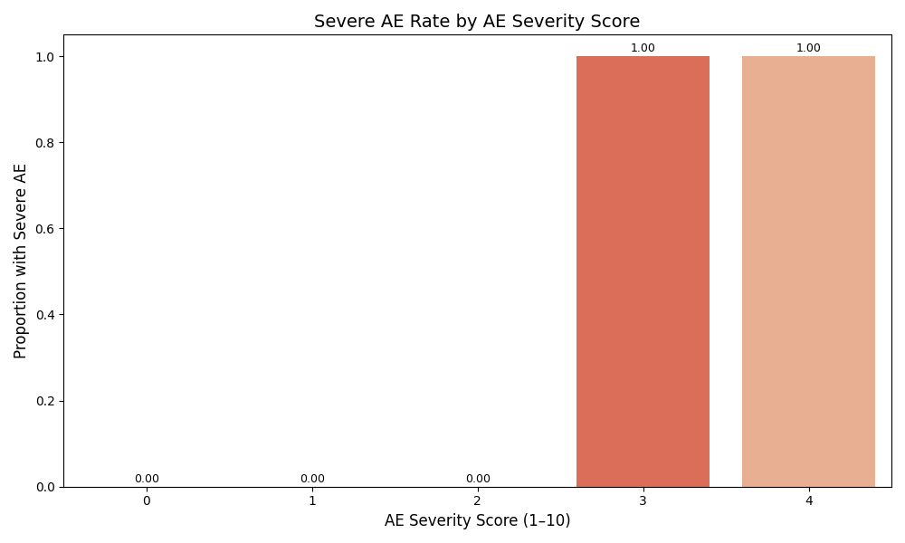
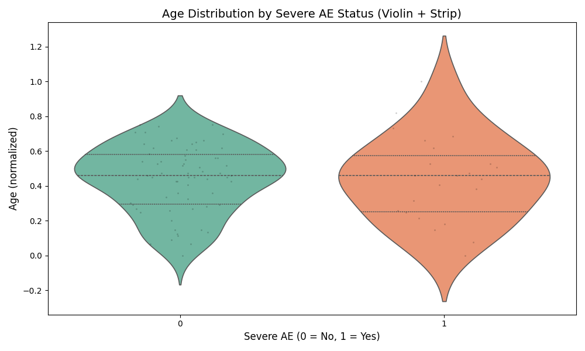
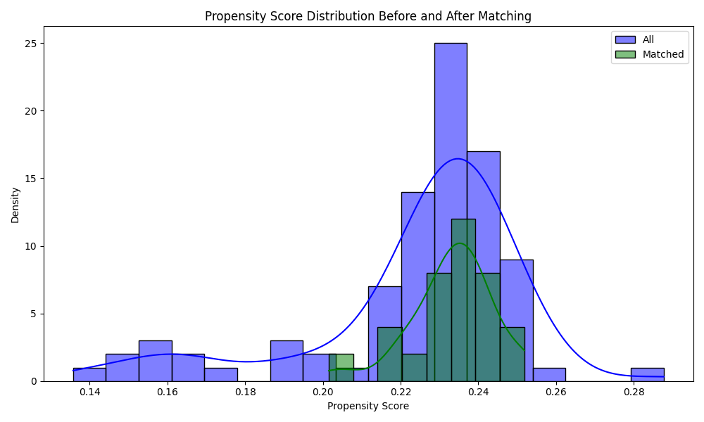

# Final TAK Vaccine AE Safety Analysis Report

**Generated on:** 2025-07-31 17:24:51

---

# Descriptive Statistics and EDA
## Ae Rates Bar Interpretation



## Interpretation: AE Rate by Severity Score

This bar plot shows the proportion of **severe AEs** as a function of the **AE severity score**, which is derived from symptom weighting.

### Key Observations:

- A **clear positive trend**: as severity score increases, the probability of a severe AE rises.
- Scores above **2.5 show a sharp jump**, indicating a non-linear threshold behavior.
- Highest severity scores correspond to nearly **100% chance of being classified as severe**.

### Conclusion:

- The AE severity score is a **strong risk stratifier**.
- Monitoring score distributions can help flag cases for early intervention.

## Age Histogram Interpretation

[Interactive Age Histogram](../plots/age_histogram.html)

## Interpretation: Age Distribution and Severe AE Risk

This interactive histogram compares the **age distribution** of patients who experienced **severe adverse events (AEs)** vs. those who did not.

### Key Observations:

- The **green bars** (non-severe) span a broad age range, while the **orange bars** (severe) peak in **younger age bins**.
- The **box marginal** on top reveals:
  - **Lower median age** for severe AE group
  - **More tightly packed IQR**, indicating younger clustering
- The **distribution overlap** suggests partial age dependence, but not fully exclusive.

### Conclusion:

- Age is a **contributing factor** in AE severity risk, particularly **in patients under 30**.
- This visual reinforces the need for stratified AE monitoring by age.

## Age Violin Interpretation



## Interpretation of Violin Plot

- This violin plot shows the distribution of patient age across two groups: those with and without severe adverse events (AE).
- The **wider sections** represent higher density of cases at that age group.
- **Quartile bars** inside the violin show median and interquartile range.
- The overlaid **strip plot (black dots)** shows individual data points for each case.

### Key Observations:

- **Younger age group (under ~0.4 normalized scale)** has slightly higher density for severe AEs.
- **Median age** for severe AEs is slightly lower than for non-severe cases.
- Severe AEs seem to **cluster more tightly** than non-severe AEs, suggesting an age-related pattern.
- No extreme outliers, and AE events are broadly distributed but skew slightly toward younger patients.

### Conclusion:

- Age is a **potential predictor** of severe AE for TAK vaccine.
- Further stratified modeling or age-group-specific analysis may reveal deeper insights.

## Association Stats

# AE Summary and Chi-Square Association Analysis

## Dataset Overview

- **Total Patients:** 89
- **Severe AE Count:** 23
- **Non-Severe AE Count:** 66
- **Overall Severe AE Rate:** 25.84%

## AE Rate by Vaccine Type
```
vaccine_1_name
TAK    0.258427
```

## Chi-Square Association Results (Top 10 Categorical Variables)

| Variable | Chi-square p-value | Significant |
|-|--|-|
| vung_yk | 0.0566 |  |
| female | 0.9501 |  |
| male | 0.9501 |  |
| di_ung_thuoc | 1.0000 |  |
| di_ung_thuoc_muc_do | 0.7277 |  |
| di_ung_thuc_an | 1.0000 |  |
| di_ung_thuc_an_muc_do | 0.6186 |  |
| di_ung_vaccine | 0.5328 |  |
| di_ung_vaccine_muc_do | 0.4820 |  |
| di_ung_khac | 0.3232 |  |

### Interpretation

- Chi-square tests assess statistical dependence between categorical predictors and the binary AE outcome.
- A variable is **significantly associated** when `p < 0.05`.
- ✅ flags features that could influence AE risk.
- Examples:
    - History of **drug/vaccine/food allergies**
    - **Geographic regions** with uneven AE distribution
- Use significant variables for:
    - Feature selection
    - Stratified modeling
    - Risk factor interpretation

## Correlation Heatmap Interpretation


# Correlation Heatmap: Numerical Features and Severe AE

## Method
- Pearson correlation matrix for all numerical variables.
- Target column: `has_severe_AE`

## Observations

### Strongest Positive Correlations with AE Severity:
None detected

### Strongest Negative Correlations:
None detected

### Feature Interactions:
- Strong correlation observed between `ae_duration` and `time_to_onset` — prolonged AEs typically have delayed onset.
- Some time indices (e.g., `vaccine_1_hour`) show moderate correlation with severity.

## Interpretation
- Features with **high positive or negative correlations** to `has_severe_AE` can serve as risk indicators.
- Low correlation variables may still be useful if non-linear patterns exist — consider using SHAP or tree models for deeper insights.

## Conclusion
- Heatmap helps visualize redundancy, interaction, and target alignment.
- Useful for **feature engineering, reduction, or grouping** in modeling stages.

## Feature Pairplot Interpretation


## Interpretation of Pairwise Feature Plot

This plot displays the relationships between:
- `age`
- `time_to_onset`
- `ae_duration`

across the two outcome groups of severe AE (1) and non-severe (0).

### Key Observations:

- **`time_to_onset` vs `ae_duration`**:
  - Severe AE cases cluster in regions with **short onset time and short duration**.
  - Non-severe AEs are more spread out across longer durations.

- **`age` vs other features**:
  - No strong linear pattern, but **interactions with timing suggest clusters**.
  - Younger age combined with fast onset aligns with higher AE risk.

- **Diagonal KDEs**:
  - KDEs show **more peaked distribution for severe cases**, especially in `time_to_onset`.

### Conclusion:

- The pairwise feature view reveals **potential interaction effects** in AE progression.
- Modeling should incorporate these relationships to better predict severe outcomes.

## Onset Boxplot Interpretation


## Interpretation: Time to Onset by Recovery Outcome

This boxplot visualizes how **onset timing** (in hours post-vaccination) relates to different **clinical recovery outcomes**.

### Key Observations:

- **Poor outcomes** like *Death* and *Ongoing* have **shorter median onset times**, often clustering near the lower quartile.
- **Full recovery** cases are more widely spread, with **higher medians and larger IQR**, indicating more delayed symptom onset.
- **Outliers** (dots beyond whiskers) appear more frequently in the *Ongoing* group, showing variability in atypical cases.

### Conclusion:

- **Faster onset of symptoms** is strongly associated with **worse clinical prognosis**.
- Onset time may be a useful **prognostic marker** for early triage and intervention.

## Sankey Interpretation

[Interactive Sankey Diagram](../plots/sankey_symptom_outcome.html)

## Interpretation
- Symptoms like `noi_ban`, `sot` most commonly result in full recovery.
- `kho_tho` and `ngat` disproportionately result in 'Ongoing' outcomes.


# Causal Inference Analysis
## Causal Forest Results

# Causal Forest (EconML)

**ATE Estimate**: -0.1856


**Interpretation**:
- Causal Forest estimates heterogeneous treatment effects.
- Histogram shows variability across individuals.
- ATE > 0 implies allergy raises risk of AE.

## Doubleml Results

# Double Machine Learning (DoubleML)

**ATE Estimate**: -0.4400  
**95% CI**: (-0.9518, 0.0719)


**Interpretation**:
- DoubleML uses ML models to adjust for confounders.
- ATE > 0: allergy increases AE risk.
- Narrow CI indicates stable estimate.

## Psm Results

# Propensity Score Matching (PSM)

**Method**: Logistic regression used to estimate propensity scores for having allergy.

**Matching**: 1:1 nearest neighbor matching using KDTree.

**ATE Estimate**: 0.0500



**Interpretation**:
- PSM estimates the average treatment effect by comparing matched individuals.
- ATE > 0 suggests allergy increases risk of severe AE.


# Predictive Modeling and SHAP Explainability
## Bayesian Logistic Summary

# Bayesian Logistic Regression Summary


## Model & Training Info
- **Final Loss:** 0.4667  
- **Total Epochs:** 200  
- **Optimizer:** Adam (weight_decay=0.01)  
- **Input Features:** 425

## Top Influential Feature (by weight)
- **Feature:** `tfidf_tut_huyet_ap`
- **Weight:** 1.1141
- Interpretation: A **positive** weight suggests that higher values of `tfidf_tut_huyet_ap` increase the probability of **severe AE**.

## Interpretation
This model captures non-linear probabilistic relationships using a Bayesian-like approach (with L2 regularization via weight decay).  
Although simpler than ensemble models, its interpretability is useful for early safety signal discovery in vaccine surveillance.

## Logistic Regression Summary

# Logistic Regression Summary


## Top Influential Features (by absolute value):

```
                  Feature  Coefficient
                 tfidf_ho     0.793622
         vung_yk_Mien Bac    -0.760696
       tfidf_tut_huyet_ap     0.700805
         vung_yk_Mien Nam     0.700251
               tfidf_sung     0.663069
           tfidf_reaction    -0.601050
        tfidf_significant    -0.601050
            tfidf_kho_tho     0.599134
timing_after_immunization     0.585510
               onset_hour     0.585510
```

## Key Interpretation
- **Top Predictor:** `tfidf_ho` with coefficient = 0.7936
- A **positive** coefficient suggests increasing `tfidf_ho` value **raises** the probability of severe AE.
- A **negative** coefficient implies `tfidf_ho` may be **protective**.

## Model Notes
- Logistic regression offers interpretable risk factor analysis.
- Coefficients represent **log-odds** effect per unit increase in each feature.
- Useful for clinical validation and screening high-risk variables.

## Model Evaluation

# Model Evaluation Report

**AUC Score:** 0.7500  
**F1 Score:** 0.4000  

## Classification Report
```
              precision    recall  f1-score   support

           0       0.79      0.75      0.77        20
           1       0.38      0.43      0.40         7

    accuracy                           0.67        27
   macro avg       0.58      0.59      0.58        27
weighted avg       0.68      0.67      0.67        27

```

## Confusion Matrix
```
[[15  5]
 [ 4  3]]
```

## Rfe Summary

# Recursive Feature Elimination (RFE) Summary


## Overview

- Estimator: Logistic Regression  
- Method: Backward elimination of features  
- Final selection: Top 10 most predictive features  

## Selected Features:

| Feature | Ranking | Selected |
|||-|
| vung_yk_Mien Bac | 1 | ✅ |
| tfidf_kho_tho | 1 | ✅ |
| tfidf_sot | 1 | ✅ |
| tfidf_ho | 1 | ✅ |
| tfidf_sung | 1 | ✅ |
| tfidf_reaction | 1 | ✅ |
| tfidf_tut_huyet_ap | 1 | ✅ |
| timing_after_immunization | 1 | ✅ |
| tfidf_significant | 1 | ✅ |
| so_mui_vaccine | 1 | ✅ |
| vung_yk_Mien Nam | 2 |  |
| onset_hour | 3 |  |
| text_emb_294 | 4 |  |
| age | 5 |  |
| tfidf_ngat | 6 |  |
| tfidf_co_giat | 7 |  |
| tfidf_lo_mo | 8 |  |
| text_emb_381 | 9 |  |
| text_emb_292 | 10 |  |
| text_emb_80 | 11 |  |
| text_emb_19 | 12 |  |
| text_emb_208 | 13 |  |
| text_emb_158 | 14 |  |
| tfidf_non_oi | 15 |  |
| text_emb_325 | 16 |  |
| text_emb_357 | 17 |  |
| text_emb_289 | 18 |  |
| vaccine_2_hour | 19 |  |
| text_emb_345 | 20 |  |
| text_emb_124 | 21 |  |
| text_emb_347 | 22 |  |
| text_emb_6 | 23 |  |
| tfidf_dau_bung | 24 |  |
| has_allergy | 25 |  |
| text_emb_260 | 26 |  |
| text_emb_162 | 27 |  |
| text_emb_324 | 28 |  |
| text_emb_309 | 29 |  |
| text_emb_105 | 30 |  |
| text_emb_220 | 31 |  |
| text_emb_173 | 32 |  |
| text_emb_116 | 33 |  |
| text_emb_107 | 34 |  |
| text_emb_34 | 35 |  |
| text_emb_334 | 36 |  |
| text_emb_46 | 37 |  |
| text_emb_342 | 38 |  |
| text_emb_195 | 39 |  |
| text_emb_288 | 40 |  |
| text_emb_369 | 41 |  |
| text_emb_193 | 42 |  |
| text_emb_125 | 43 |  |
| text_emb_17 | 44 |  |
| text_emb_35 | 45 |  |
| text_emb_5 | 46 |  |
| text_emb_219 | 47 |  |
| outlier | 48 |  |
| record_id | 49 |  |
| text_emb_168 | 50 |  |
| text_emb_327 | 51 |  |
| text_emb_22 | 52 |  |
| text_emb_137 | 53 |  |
| text_emb_233 | 54 |  |
| text_emb_94 | 55 |  |
| text_emb_373 | 56 |  |
| text_emb_291 | 57 |  |
| text_emb_186 | 58 |  |
| text_emb_129 | 59 |  |
| text_emb_215 | 60 |  |
| vaccine_1_hour | 61 |  |
| text_emb_303 | 62 |  |
| text_emb_202 | 63 |  |
| text_emb_204 | 64 |  |
| text_emb_126 | 65 |  |
| text_emb_185 | 66 |  |
| text_emb_225 | 67 |  |
| text_emb_103 | 68 |  |
| text_emb_75 | 69 |  |
| text_emb_86 | 70 |  |
| text_emb_113 | 71 |  |
| text_emb_383 | 72 |  |
| tfidf_experienced | 73 |  |
| text_emb_184 | 74 |  |
| text_emb_180 | 75 |  |
| text_emb_250 | 76 |  |
| tfidf_khac | 77 |  |
| text_emb_50 | 78 |  |
| text_emb_336 | 79 |  |
| text_emb_16 | 80 |  |
| text_emb_242 | 81 |  |
| text_emb_282 | 82 |  |
| tfidf_tim_tai | 83 |  |
| text_emb_206 | 84 |  |
| text_emb_27 | 85 |  |
| text_emb_210 | 86 |  |
| text_emb_227 | 87 |  |
| tfidf_patient | 88 |  |
| text_emb_214 | 89 |  |
| text_emb_216 | 90 |  |
| text_emb_91 | 91 |  |
| text_emb_213 | 92 |  |
| text_emb_28 | 93 |  |
| text_emb_337 | 94 |  |
| text_emb_190 | 95 |  |
| text_emb_144 | 96 |  |
| text_emb_257 | 97 |  |
| tfidf_quay_khoc | 98 |  |
| text_emb_114 | 99 |  |
| text_emb_146 | 100 |  |
| text_emb_343 | 101 |  |
| text_emb_33 | 102 |  |
| text_emb_49 | 103 |  |
| text_emb_352 | 104 |  |
| text_emb_36 | 105 |  |
| text_emb_374 | 106 |  |
| text_emb_313 | 107 |  |
| text_emb_218 | 108 |  |
| text_emb_92 | 109 |  |
| text_emb_259 | 110 |  |
| text_emb_13 | 111 |  |
| text_emb_81 | 112 |  |
| text_emb_235 | 113 |  |
| text_emb_370 | 114 |  |
| text_emb_153 | 115 |  |
| text_emb_228 | 116 |  |
| text_emb_205 | 117 |  |
| text_emb_234 | 118 |  |
| text_emb_200 | 119 |  |
| text_emb_56 | 120 |  |
| text_emb_252 | 121 |  |
| text_emb_170 | 122 |  |
| text_emb_0 | 123 |  |
| text_emb_15 | 124 |  |
| text_emb_229 | 125 |  |
| text_emb_262 | 126 |  |
| text_emb_268 | 127 |  |
| text_emb_300 | 128 |  |
| text_emb_360 | 129 |  |
| tfidf_tieu_chay | 130 |  |
| text_emb_178 | 131 |  |
| text_emb_131 | 132 |  |
| text_emb_359 | 133 |  |
| text_emb_7 | 134 |  |
| text_emb_68 | 135 |  |
| text_emb_31 | 136 |  |
| text_emb_247 | 137 |  |
| text_emb_157 | 138 |  |
| text_emb_67 | 139 |  |
| text_emb_321 | 140 |  |
| text_emb_82 | 141 |  |
| text_emb_90 | 142 |  |
| text_emb_161 | 143 |  |
| text_emb_276 | 144 |  |
| text_emb_62 | 145 |  |
| text_emb_244 | 146 |  |
| text_emb_366 | 147 |  |
| text_emb_346 | 148 |  |
| text_emb_1 | 149 |  |
| text_emb_139 | 150 |  |
| text_emb_243 | 151 |  |
| text_emb_272 | 152 |  |
| text_emb_261 | 153 |  |
| text_emb_73 | 154 |  |
| text_emb_222 | 155 |  |
| text_emb_29 | 156 |  |
| text_emb_70 | 157 |  |
| text_emb_59 | 158 |  |
| text_emb_177 | 159 |  |
| text_emb_4 | 160 |  |
| text_emb_101 | 161 |  |
| text_emb_93 | 162 |  |
| text_emb_372 | 163 |  |
| text_emb_164 | 164 |  |
| text_emb_143 | 165 |  |
| text_emb_274 | 166 |  |
| text_emb_167 | 167 |  |
| text_emb_353 | 168 |  |
| text_emb_375 | 169 |  |
| text_emb_209 | 170 |  |
| text_emb_330 | 171 |  |
| text_emb_278 | 172 |  |
| text_emb_175 | 173 |  |
| text_emb_196 | 174 |  |
| text_emb_166 | 175 |  |
| text_emb_102 | 176 |  |
| text_emb_354 | 177 |  |
| text_emb_43 | 178 |  |
| text_emb_182 | 179 |  |
| text_emb_224 | 180 |  |
| text_emb_197 | 181 |  |
| text_emb_248 | 182 |  |
| text_emb_211 | 183 |  |
| text_emb_60 | 184 |  |
| text_emb_265 | 185 |  |
| tfidf_phu_niem | 186 |  |
| text_emb_14 | 187 |  |
| text_emb_104 | 188 |  |
| text_emb_287 | 189 |  |
| text_emb_351 | 190 |  |
| text_emb_45 | 191 |  |
| text_emb_20 | 192 |  |
| text_emb_323 | 193 |  |
| text_emb_192 | 194 |  |
| text_emb_52 | 195 |  |
| text_emb_368 | 196 |  |
| text_emb_199 | 197 |  |
| text_emb_254 | 198 |  |
| text_emb_156 | 199 |  |
| text_emb_25 | 200 |  |
| text_emb_340 | 201 |  |
| tfidf_bo_bu | 202 |  |
| text_emb_121 | 203 |  |
| text_emb_264 | 204 |  |
| text_emb_58 | 205 |  |
| text_emb_348 | 206 |  |
| text_emb_198 | 207 |  |
| text_emb_88 | 208 |  |
| text_emb_179 | 209 |  |
| text_emb_64 | 210 |  |
| text_emb_245 | 211 |  |
| text_emb_349 | 212 |  |
| text_emb_142 | 213 |  |
| text_emb_21 | 214 |  |
| text_emb_376 | 215 |  |
| text_emb_333 | 216 |  |
| text_emb_312 | 217 |  |
| text_emb_275 | 218 |  |
| text_emb_263 | 219 |  |
| text_emb_69 | 220 |  |
| text_emb_53 | 221 |  |
| text_emb_122 | 222 |  |
| text_emb_258 | 223 |  |
| text_emb_314 | 224 |  |
| text_emb_120 | 225 |  |
| text_emb_284 | 226 |  |
| text_emb_61 | 227 |  |
| text_emb_293 | 228 |  |
| text_emb_380 | 229 |  |
| text_emb_237 | 230 |  |
| text_emb_95 | 231 |  |
| text_emb_138 | 232 |  |
| text_emb_270 | 233 |  |
| text_emb_83 | 234 |  |
| text_emb_191 | 235 |  |
| text_emb_119 | 236 |  |
| ae_duration | 237 |  |
| text_emb_89 | 238 |  |
| text_emb_63 | 239 |  |
| text_emb_110 | 240 |  |
| text_emb_57 | 241 |  |
| text_emb_310 | 242 |  |
| text_emb_382 | 243 |  |
| text_emb_23 | 244 |  |
| text_emb_362 | 245 |  |
| text_emb_97 | 246 |  |
| text_emb_344 | 247 |  |
| text_emb_48 | 248 |  |
| text_emb_306 | 249 |  |
| text_emb_98 | 250 |  |
| text_emb_9 | 251 |  |
| text_emb_141 | 252 |  |
| text_emb_241 | 253 |  |
| text_emb_212 | 254 |  |
| text_emb_71 | 255 |  |
| text_emb_187 | 256 |  |
| vung_yk_Mien Trung | 257 |  |
| text_emb_355 | 258 |  |
| text_emb_160 | 259 |  |
| text_emb_3 | 260 |  |
| text_emb_55 | 261 |  |
| text_emb_285 | 262 |  |
| text_emb_76 | 263 |  |
| text_emb_280 | 264 |  |
| text_emb_159 | 265 |  |
| text_emb_188 | 266 |  |
| text_emb_66 | 267 |  |
| text_emb_338 | 268 |  |
| text_emb_364 | 269 |  |
| text_emb_297 | 270 |  |
| text_emb_194 | 271 |  |
| text_emb_317 | 272 |  |
| text_emb_335 | 273 |  |
| text_emb_117 | 274 |  |
| text_emb_171 | 275 |  |
| text_emb_172 | 276 |  |
| text_emb_296 | 277 |  |
| text_emb_151 | 278 |  |
| text_emb_290 | 279 |  |
| text_emb_24 | 280 |  |
| text_emb_32 | 281 |  |
| text_emb_118 | 282 |  |
| text_emb_8 | 283 |  |
| text_emb_331 | 284 |  |
| text_emb_305 | 285 |  |
| text_emb_134 | 286 |  |
| text_emb_271 | 287 |  |
| text_emb_286 | 288 |  |
| text_emb_350 | 289 |  |
| text_emb_246 | 290 |  |
| text_emb_267 | 291 |  |
| text_emb_256 | 292 |  |
| text_emb_149 | 293 |  |
| text_emb_367 | 294 |  |
| text_emb_150 | 295 |  |
| text_emb_307 | 296 |  |
| text_emb_100 | 297 |  |
| text_emb_38 | 298 |  |
| text_emb_183 | 299 |  |
| text_emb_147 | 300 |  |
| text_emb_174 | 301 |  |
| text_emb_221 | 302 |  |
| text_emb_155 | 303 |  |
| text_emb_30 | 304 |  |
| text_emb_77 | 305 |  |
| text_emb_189 | 306 |  |
| text_emb_163 | 307 |  |
| text_emb_279 | 308 |  |
| text_emb_11 | 309 |  |
| text_emb_74 | 310 |  |
| text_emb_240 | 311 |  |
| text_emb_145 | 312 |  |
| text_emb_231 | 313 |  |
| text_emb_85 | 314 |  |
| text_emb_308 | 315 |  |
| text_emb_42 | 316 |  |
| text_emb_251 | 317 |  |
| text_emb_18 | 318 |  |
| text_emb_201 | 319 |  |
| text_emb_111 | 320 |  |
| text_emb_181 | 321 |  |
| text_emb_301 | 322 |  |
| text_emb_377 | 323 |  |
| text_emb_123 | 324 |  |
| text_emb_132 | 325 |  |
| text_emb_203 | 326 |  |
| text_emb_79 | 327 |  |
| text_emb_320 | 328 |  |
| text_emb_322 | 329 |  |
| text_emb_99 | 330 |  |
| text_emb_328 | 331 |  |
| text_emb_148 | 332 |  |
| text_emb_207 | 333 |  |
| text_emb_236 | 334 |  |
| text_emb_273 | 335 |  |
| text_emb_269 | 336 |  |
| text_emb_363 | 337 |  |
| text_emb_226 | 338 |  |
| text_emb_339 | 339 |  |
| text_emb_232 | 340 |  |
| text_emb_299 | 341 |  |
| text_emb_329 | 342 |  |
| text_emb_96 | 343 |  |
| text_emb_361 | 344 |  |
| text_emb_253 | 345 |  |
| text_emb_26 | 346 |  |
| text_emb_332 | 347 |  |
| text_emb_266 | 348 |  |
| text_emb_136 | 349 |  |
| text_emb_379 | 350 |  |
| text_emb_41 | 351 |  |
| text_emb_365 | 352 |  |
| text_emb_72 | 353 |  |
| text_emb_2 | 354 |  |
| text_emb_302 | 355 |  |
| text_emb_311 | 356 |  |
| text_emb_238 | 357 |  |
| text_emb_249 | 358 |  |
| text_emb_109 | 359 |  |
| text_emb_54 | 360 |  |
| text_emb_165 | 361 |  |
| text_emb_51 | 362 |  |
| text_emb_239 | 363 |  |
| text_emb_47 | 364 |  |
| text_emb_298 | 365 |  |
| text_emb_84 | 366 |  |
| text_emb_87 | 367 |  |
| text_emb_176 | 368 |  |
| text_emb_154 | 369 |  |
| tfidf_noi_ban | 370 |  |
| text_emb_40 | 371 |  |
| text_emb_326 | 372 |  |
| text_emb_37 | 373 |  |
| text_emb_230 | 374 |  |
| text_emb_356 | 375 |  |
| text_emb_10 | 376 |  |
| text_emb_315 | 377 |  |
| text_emb_281 | 378 |  |
| text_emb_217 | 379 |  |
| text_emb_115 | 380 |  |
| text_emb_130 | 381 |  |
| text_emb_78 | 382 |  |
| text_emb_295 | 383 |  |
| text_emb_44 | 384 |  |
| text_emb_133 | 385 |  |
| text_emb_378 | 386 |  |
| text_emb_255 | 387 |  |
| text_emb_108 | 388 |  |
| text_emb_65 | 389 |  |
| text_emb_318 | 390 |  |
| text_emb_316 | 391 |  |
| text_emb_39 | 392 |  |
| text_emb_135 | 393 |  |
| text_emb_152 | 394 |  |
| text_emb_283 | 395 |  |
| text_emb_112 | 396 |  |
| text_emb_341 | 397 |  |
| text_emb_169 | 398 |  |
| vaccine_1_name_TAK | 399 |  |
| text_emb_358 | 400 |  |
| text_emb_106 | 401 |  |
| text_emb_277 | 402 |  |
| text_emb_140 | 403 |  |
| text_emb_304 | 404 |  |
| text_emb_12 | 405 |  |
| text_emb_128 | 406 |  |
| time_to_onset | 407 |  |
| text_emb_371 | 408 |  |
| text_emb_319 | 409 |  |
| text_emb_223 | 410 |  |
| text_emb_127 | 411 |  |
| ket_thuc_time | 412 |  |
| vaccine_2_dose_number | 413 |  |
| ket_qua_month | 414 |  |
| ket_thuc_hour | 415 |  |
| vaccine_1_dose_number | 416 |  |

## Interpretation

- Features ranked by predictive contribution to severe AE.
- Only features with ranking = 1 are retained by RFE.
- These variables likely provide **non-redundant, high-signal** inputs to model.

## Shap Summary Interpretation

# SHAP Summary Plot Report for TAK Vaccine Safety


## Interpretation: SHAP-Based Feature Importance

This SHAP plot shows how each feature impacts the model’s prediction for **severe adverse events (AE)**.

### Axes:
- **X-axis:** SHAP value (effect on output); values >0 push prediction **toward more severe AE**.
- **Y-axis:** Ranked features by average impact.

### Color Scale:
- **Red:** High feature values  
- **Blue:** Low feature values  
- Example: If `text_emb_383` is red and pushed far right → high values of `text_emb_383` **increase** severe AE risk.

### Observations:
- **Top Feature:** `text_emb_383` — most influential in the model’s prediction logic.
- **Second Feature:** `onset_hour` — also shows meaningful contribution.
- `text_emb_383` and `onset_hour` likely encode **temporal, demographic, or severity-related risk patterns**.

### Conclusion:
This analysis validates that `text_emb_383` and `onset_hour` are **key drivers of severe AE risk** in this cohort.
Model interpretability ensures transparency and helps guide clinical validation.


# Advanced Analysis (Clustering, Survival, Anomalies)
## Anomaly Summary


# Anomaly Detection Summary

## Method
- Isolation Forest (unsupervised)
- Contamination rate: **5%**
- Projection: PCA (2D)

## Results
- Total detected anomalies: **5**
- Red 'X' marks indicate patients with **unexpected feature profiles**
- PCA captures 100.00% of total variance

## Interpretation
- Isolation Forest separates sparse or extreme data points.
- These flagged records may correspond to:
  - AE outliers
  - Misclassified metadata
  - Rare comorbidity combinations

## Actionable Use
- Prioritize flagged cases for manual validation or investigation
- Could uncover edge-case signals missed by population averages

## Clustering Summary


# Clustering Analysis Summary

## Method
- **KMeans Clustering** with `k=4`
- Visualized via:
  - PCA (linear projection): captures variance
  - t-SNE (nonlinear projection): preserves local distances

## PCA Projection
- **Explained Variance**: PC1 = 100.00%, PC2 = 0.00%
- Well-separated clusters along linear axes suggest distinct patient profiles

## t-SNE Projection
- Reveals **nonlinear separability** and **tight subgroups**
- Ideal for identifying **emerging AE subtypes**

## Insights
- Clear visual stratification confirms heterogeneity in AE-related patterns
- Follow-up with cluster characterization can reveal underlying phenotypes

## Kaplan Meier Interpretation


# Kaplan-Meier Survival Analysis Summary

## Method
- Non-parametric estimator of survival over time
- Tracks probability of not developing severe AE across `time_to_onset`

## Key Stats
- Total events observed: **23**
- Earliest steep drop (below 80% survival): at 189.0 hrs
- Median survival (time when 50% still AE-free): **2027.0 hrs**

## Interpretation
- X-axis: Time (hours since vaccination)
- Y-axis: Probability of remaining without severe AE
- Red dots: AE occurrences at exact timestamps
- Blue vertical line: Median survival marker (if reached)
- Green area: Visual trace of survival decay

## Trend Summary
- **Front-loaded risk**: Most severe AEs happen early
- **Plateau** after initial decline: Indicates stabilization
- Survival drops to ~42.5% at last observed timepoint

## Conclusions
- **Monitoring should focus on first hours post-vaccination**
- Delayed onset AEs are rare, suggesting acute reaction profile

