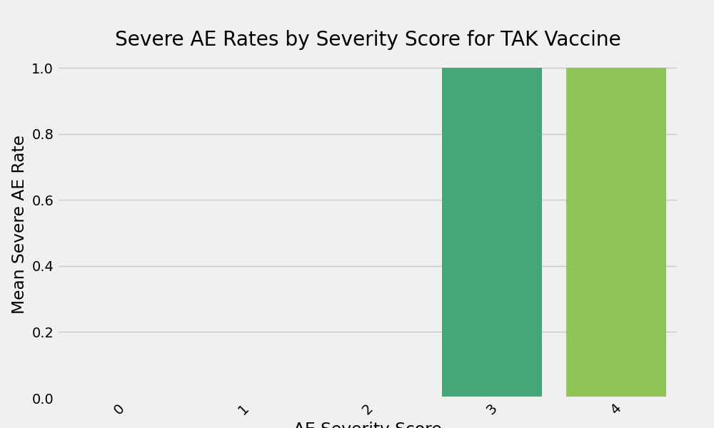

## Interpretation of AE Rates Bar Plot
X-axis: AE Severity Score (higher = more severe).
Y-axis: Mean rate of severe AEs.
Trends: Bars increase with score, showing logical progression.
Observations: Rate jumps at score 3, indicating threshold for severity.
Conclusions: Higher scores correlate with severe outcomes for TAK, concluding that severity grading is effective for risk assessment.
