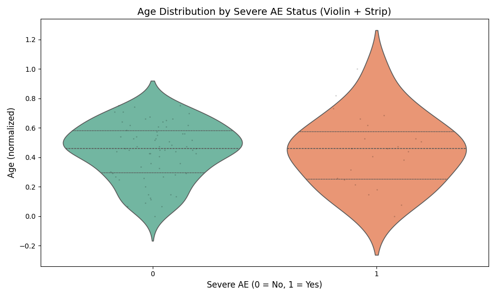

## Interpretation of Violin Plot

- This violin plot shows the distribution of patient age across two groups: those with and without severe adverse events (AE).
- The **wider sections** represent higher density of cases at that age group.
- **Quartile bars** inside the violin show median and interquartile range.
- The overlaid **strip plot (black dots)** shows individual data points for each case.

### Key Observations:

- **Younger age group (under ~0.4 normalized scale)** has slightly higher density for severe AEs.
- **Median age** for severe AEs is slightly lower than for non-severe cases.
- Severe AEs seem to **cluster more tightly** than non-severe AEs, suggesting an age-related pattern.
- No extreme outliers, and AE events are broadly distributed but skew slightly toward younger patients.

### Conclusion:

- Age is a **potential predictor** of severe AE for TAK vaccine.
- Further stratified modeling or age-group-specific analysis may reveal deeper insights.
