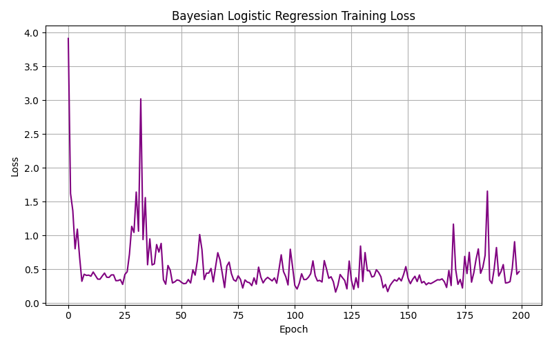

# Bayesian Logistic Regression Summary

## Model & Training Info
- **Final Loss:** 0.4667  
- **Total Epochs:** 200  
- **Optimizer:** Adam (weight_decay=0.01)  
- **Input Features:** 425

## Top Influential Feature (by weight)
- **Feature:** `tfidf_tut_huyet_ap`
- **Weight:** 1.1141
- Interpretation: A **positive** weight suggests that higher values of `tfidf_tut_huyet_ap` increase the probability of **severe AE**.

## Interpretation
This model captures non-linear probabilistic relationships using a Bayesian-like approach (with L2 regularization via weight decay).  
Although simpler than ensemble models, its interpretability is useful for early safety signal discovery in vaccine surveillance.
