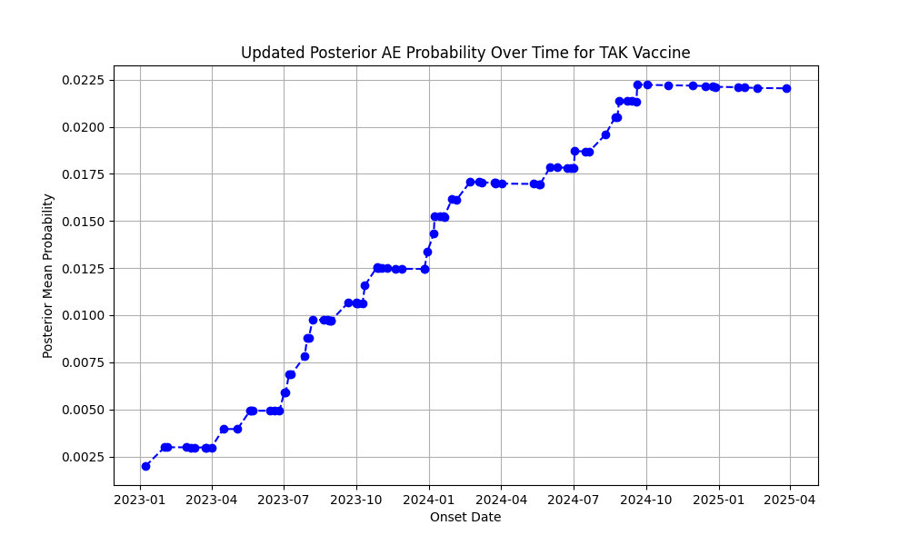

# Bayesian Update Plot Report for TAK Vaccine Safety

## Detailed Interpretation
**X Axis:** Onset dates in chronological order.

**Y Axis:** Posterior probability of severe AE (0 to 1).

**Trends Observed:** Line starts low (prior belief), rises with severe cases, stabilizes over time.

**Conclusions:** For TAK, if probability trends upward, it concludes increasing evidence of risk; observe stabilization for overall safety assessment.
