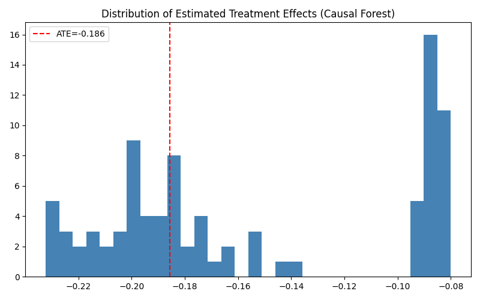

# Causal Forest (EconML)

**ATE Estimate**: -0.1856

**Interpretation**:
- Causal Forest estimates heterogeneous treatment effects.
- Histogram shows variability across individuals.
- ATE > 0 implies allergy raises risk of AE.
    