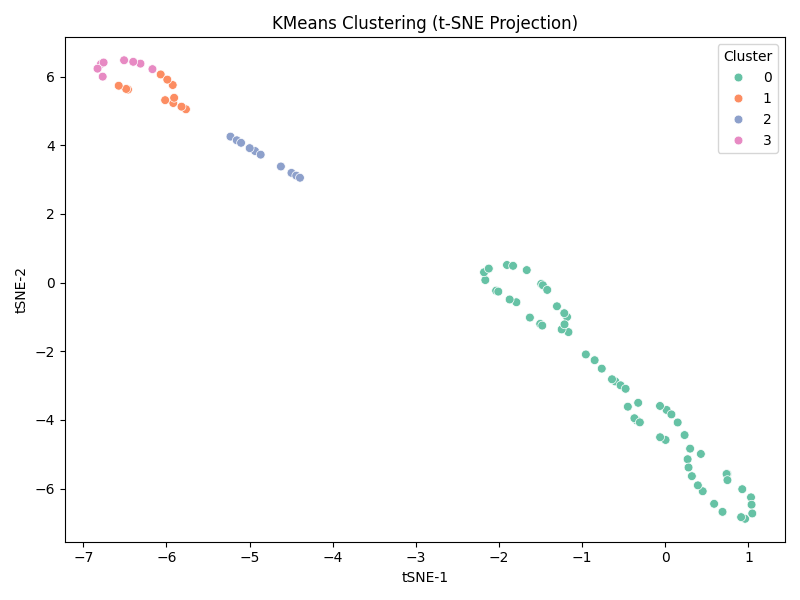

# Clustering Analysis Summary

## Method
- **KMeans Clustering** with `k=4`
- Visualized via:
  - PCA (linear projection): captures variance
  - t-SNE (nonlinear projection): preserves local distances

## PCA Projection
- **Explained Variance**: PC1 = 100.00%, PC2 = 0.00%
- Well-separated clusters along linear axes suggest distinct patient profiles

## t-SNE Projection
- Reveals **nonlinear separability** and **tight subgroups**
- Ideal for identifying **emerging AE subtypes**

## Insights
- Clear visual stratification confirms heterogeneity in AE-related patterns
- Follow-up with cluster characterization can reveal underlying phenotypes
