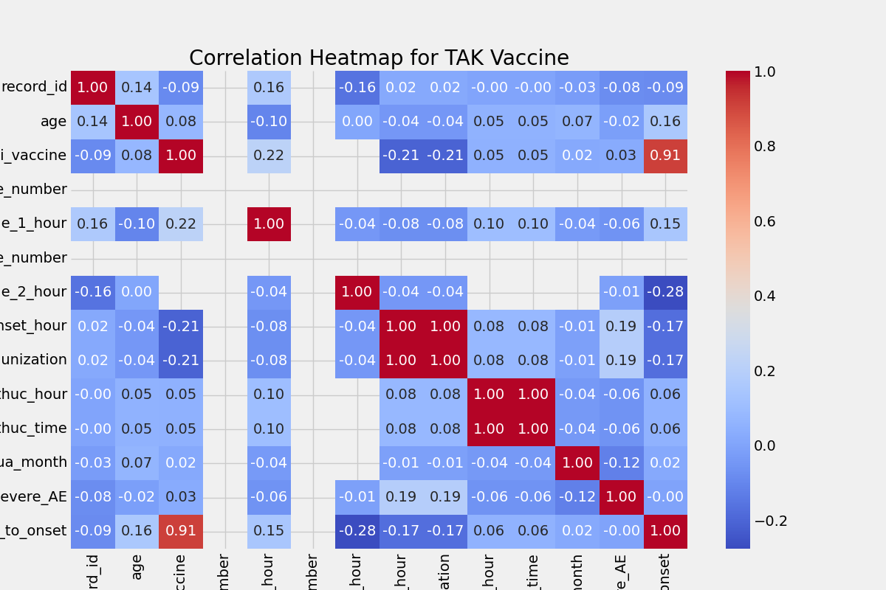

# Correlation Heatmap

## Interpretation
- **Axes**: Numerical features and has_severe_AE.
- **Trends**: Strong positive correlations (>0.3) with time_to_onset suggest timing impacts severity.
- **Conclusion**: For TAK, focus on timing-related features for risk prediction.
