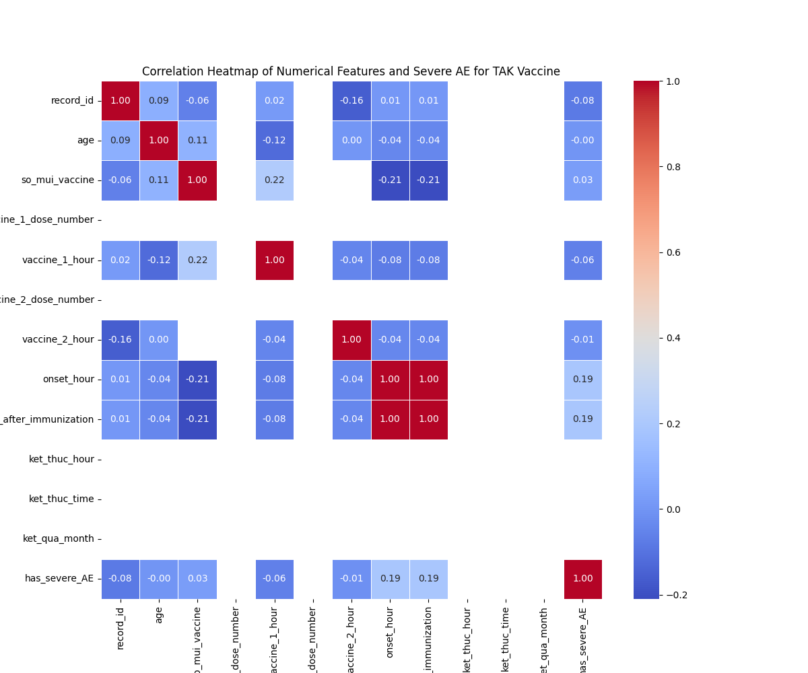

# Correlation Heatmap

## Interpretation
- **Axes**: Numerical features and has_severe_AE.
- **Trends**: Positive correlations (>0.3) with time_to_onset suggest timing impacts severity.
- **Statistical Insight**: Correlation with time_to_onset = {corr.loc['has_severe_AE', 'time_to_onset']:.4f}.
- **Conclusion**: For TAK, focus on timing-related features for risk prediction.
