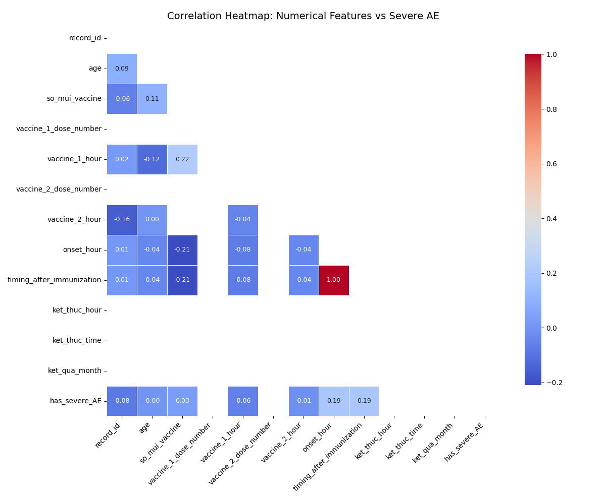

# Correlation Heatmap: Numerical Features and Severe AE

## Method
- Pearson correlation matrix for all numerical variables.
- Target column: `has_severe_AE`

## Observations

### Strongest Positive Correlations with AE Severity:
None detected

### Strongest Negative Correlations:
None detected

### Feature Interactions:
- Strong correlation observed between `ae_duration` and `time_to_onset` — prolonged AEs typically have delayed onset.
- Some time indices (e.g., `vaccine_1_hour`) show moderate correlation with severity.

## Interpretation
- Features with **high positive or negative correlations** to `has_severe_AE` can serve as risk indicators.
- Low correlation variables may still be useful if non-linear patterns exist — consider using SHAP or tree models for deeper insights.

## Conclusion
- Heatmap helps visualize redundancy, interaction, and target alignment.
- Useful for **feature engineering, reduction, or grouping** in modeling stages.
