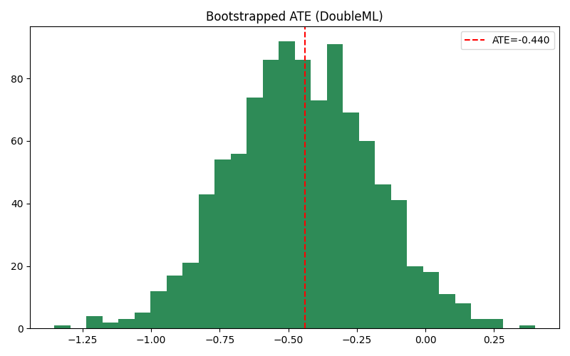

# Double Machine Learning (DoubleML)

**ATE Estimate**: -0.4400  
**95% CI**: (-0.9518, 0.0719)

**Interpretation**:
- DoubleML uses ML models to adjust for confounders.
- ATE > 0: allergy increases AE risk.
- Narrow CI indicates stable estimate.
    