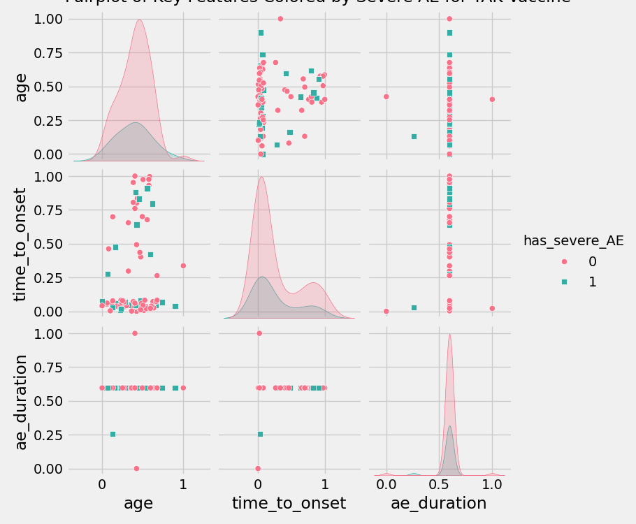

# Feature Pairplot

## Interpretation
- **Axes**: Pairwise features (age, time_to_onset, ae_duration).
- **Trends**: Severe cases cluster in lower time_to_onset.
- **Statistical Insight**: KDE shows bimodal age for non-severe cases.
- **Conclusion**: Short onset times predict severity for TAK.
