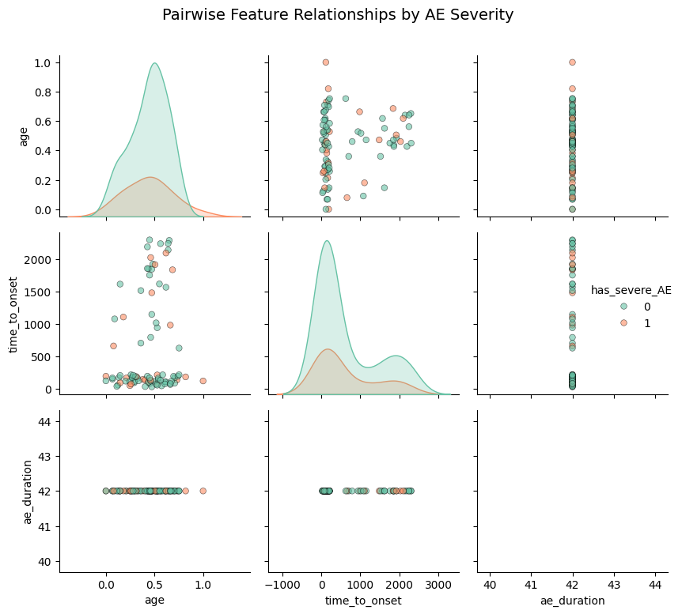

# Feature Pairplot Report for TAK Vaccine Safety

## Detailed Interpretation
**Axes:** Each subplot pair shows relationships between features like age (x/y), time_to_onset, ae_duration.
**Trends Observed:** Scatter points colored by AE status; clusters of red (severe) in low age-short onset suggest patterns.
**Conclusions:** Overlapping densities on diagonals indicate features may not strongly distinguish AEs, but scatters reveal trends like shorter durations for severe cases in TAK vaccine.
