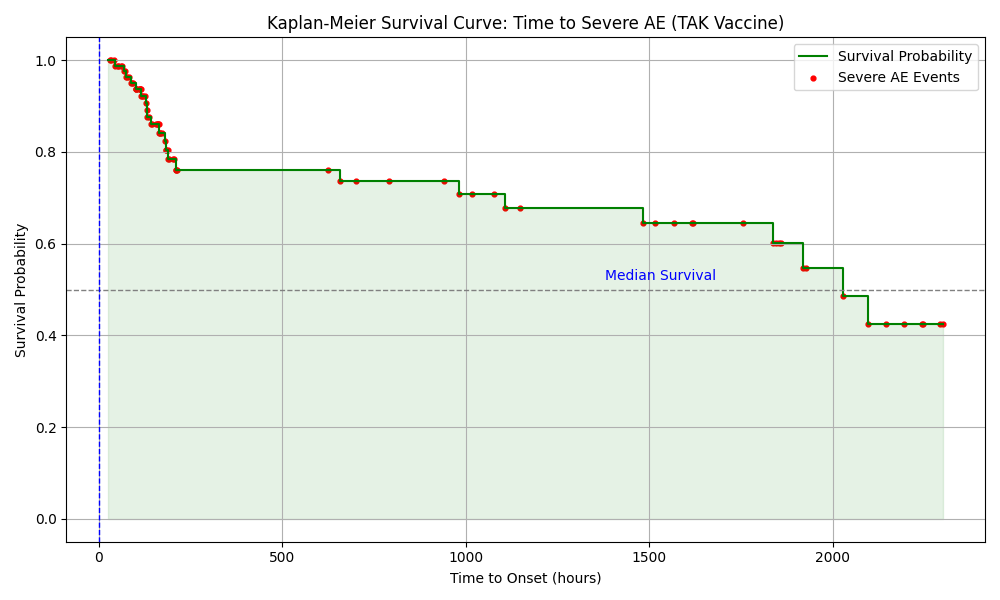

# Kaplan-Meier Survival Analysis Summary

## Method
- Non-parametric estimator of survival over time
- Tracks probability of not developing severe AE across `time_to_onset`

## Key Stats
- Total events observed: **23**
- Earliest steep drop (below 80% survival): at 189.0 hrs
- Median survival (time when 50% still AE-free): **2027.0 hrs**

## Interpretation
- X-axis: Time (hours since vaccination)
- Y-axis: Probability of remaining without severe AE
- Red dots: AE occurrences at exact timestamps
- Blue vertical line: Median survival marker (if reached)
- Green area: Visual trace of survival decay

## Trend Summary
- **Front-loaded risk**: Most severe AEs happen early
- **Plateau** after initial decline: Indicates stabilization
- Survival drops to ~42.5% at last observed timepoint

## Conclusions
- **Monitoring should focus on first hours post-vaccination**
- Delayed onset AEs are rare, suggesting acute reaction profile
