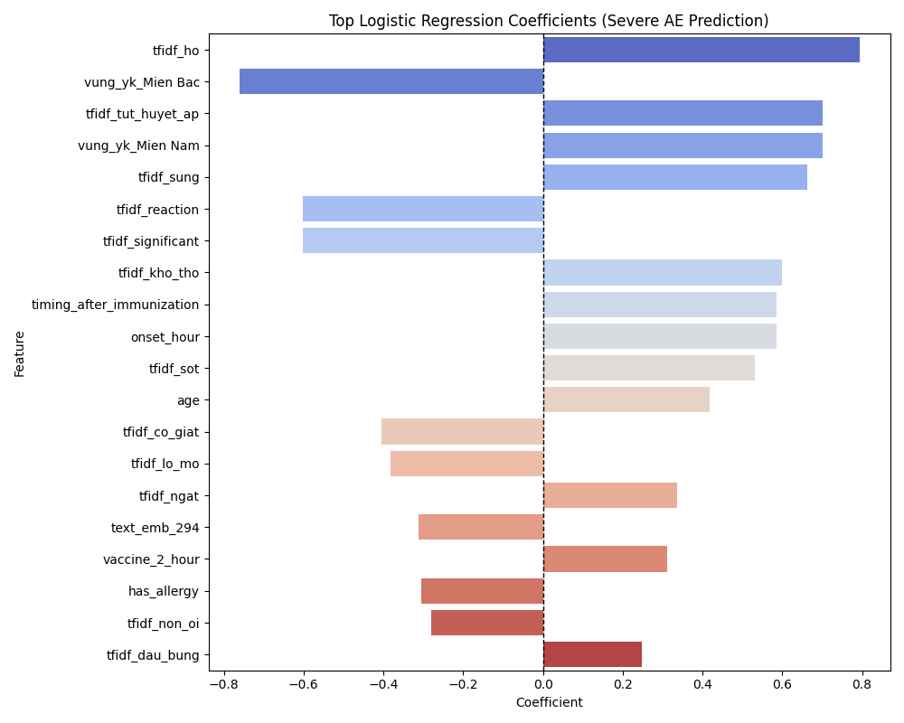

# Logistic Regression Summary



## Top Influential Features (by absolute value):

```
                  Feature  Coefficient
                 tfidf_ho     0.793622
         vung_yk_Mien Bac    -0.760696
       tfidf_tut_huyet_ap     0.700805
         vung_yk_Mien Nam     0.700251
               tfidf_sung     0.663069
           tfidf_reaction    -0.601050
        tfidf_significant    -0.601050
            tfidf_kho_tho     0.599134
timing_after_immunization     0.585510
               onset_hour     0.585510
```

## Key Interpretation
- **Top Predictor:** `tfidf_ho` with coefficient = 0.7936
- A **positive** coefficient suggests increasing `tfidf_ho` value **raises** the probability of severe AE.
- A **negative** coefficient implies `tfidf_ho` may be **protective**.

## Model Notes
- Logistic regression offers interpretable risk factor analysis.
- Coefficients represent **log-odds** effect per unit increase in each feature.
- Useful for clinical validation and screening high-risk variables.
