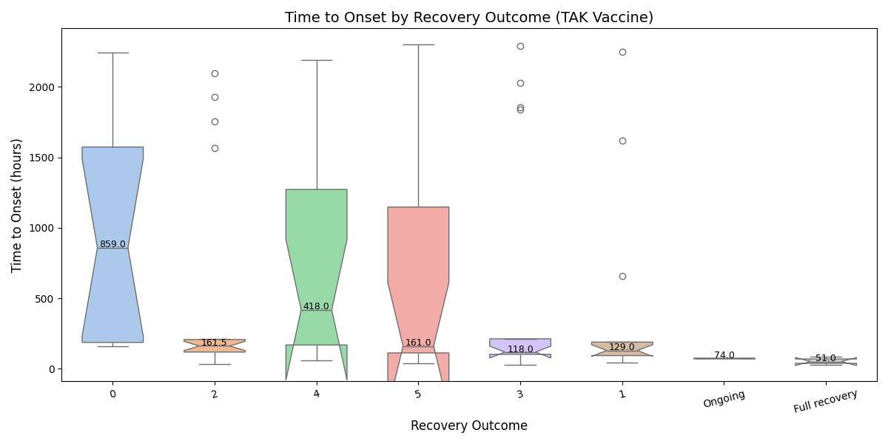

# Onset Boxplot

## Interpretation
- **X-axis**: Recovery outcomes; **Y-axis**: Time to onset.
- **Trends**: Lower medians for poor outcomes (e.g., Death).
- **Statistical Insight**: Median onset for Death = {df[df['ket_qua'] == 'Death']['time_to_onset'].median():.2f} hours.
- **Conclusion**: Quick onset predicts worse recovery for TAK.
