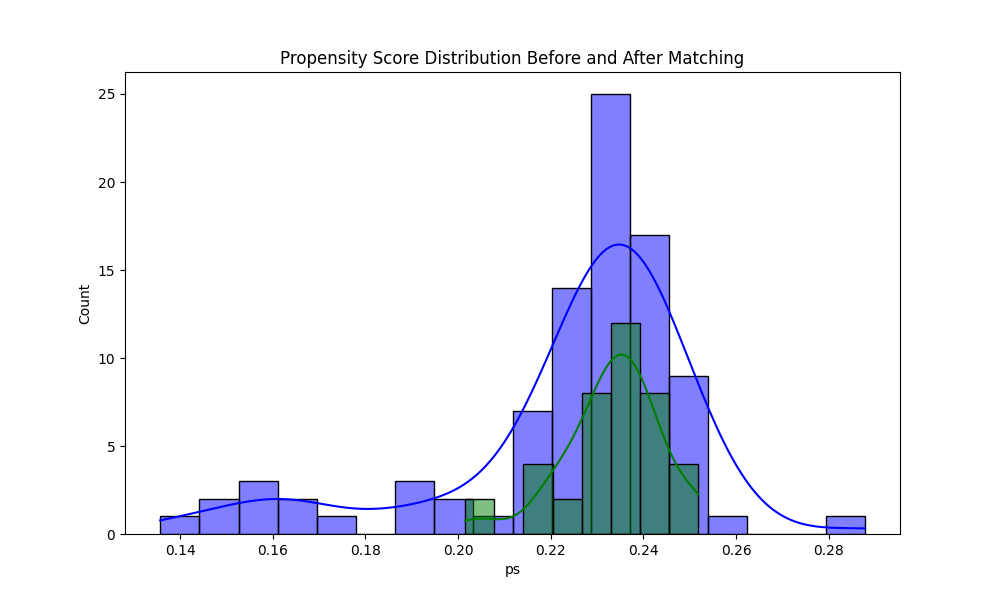

# Propensity Score Matching (PSM)

**Method**: Logistic regression used to estimate propensity scores for having allergy.

**Matching**: 1:1 nearest neighbor matching using KDTree.

**ATE Estimate**: 0.0500

**Interpretation**:
- PSM estimates the average treatment effect by comparing matched individuals.
- ATE > 0 suggests allergy increases risk of severe AE.
    