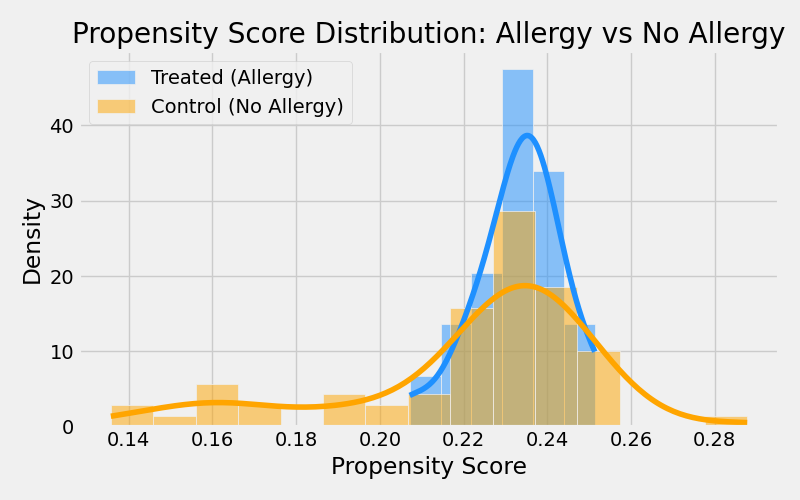

# Propensity Score Matching (PSM)

## What you see
- Blue: Patients with allergy
- Orange: Patients without allergy
- Overlap shows quality of matching

## Effect Estimate
- **ATE (Allergy → Severe AE):** 0.0500

**Interpretation:**  
If ATE > 0, allergy increases severe AE risk. Overlap in scores supports match quality, but residual confounding is possible.  
