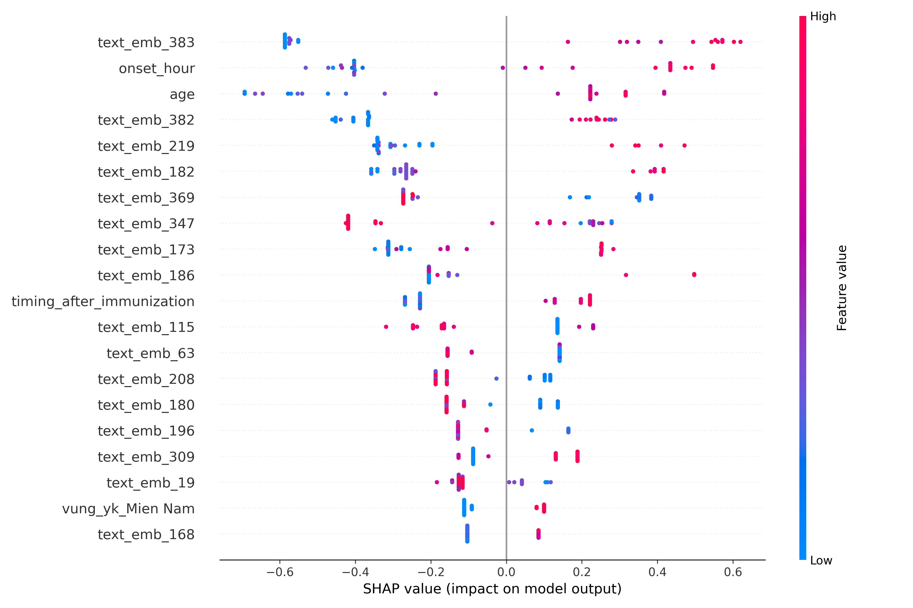

# SHAP Summary Plot

## Interpretation
- **X-axis**: SHAP values; **Y-axis**: Features.
- **Trends**: High age values (red) push negative, suggesting lower risk in elderly.
- **Statistical Insight**: Mean SHAP for time_to_onset = {np.mean(np.abs(shap_values[:, X_test.columns.get_loc('time_to_onset')])):.4f}.
- **Conclusion**: For TAK, short onset times are key risk drivers.
